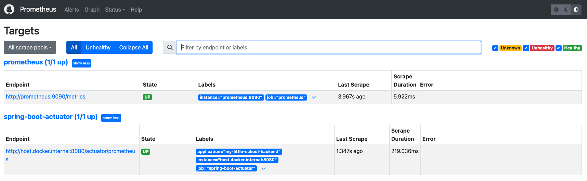
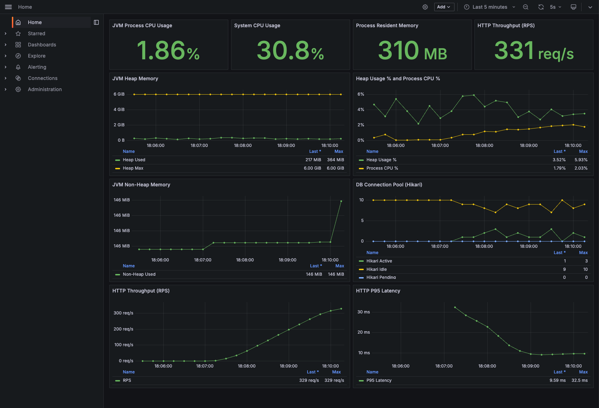

# 🏫 마이 리틀 스쿨 (My Little School) - Backend

> **소규모 학교 학생들을 위한 메타버스 기반 소셜 학습 플랫폼**

학생들이 가상 공간에서 친구를 사귀고, 나만의 교실을 꾸미며, 퀴즈와 골든벨 등 다양한 활동에 참여할 수 있는 메타버스 서비스입니다.

---
<br>


# 📋 목차

1. [프로젝트 소개](#-프로젝트-소개)
2. [기술 스택](#-기술-스택)
3. [주요 기능](#-주요-기능)
4. [ERD](#-erd)
5. [성능 최적화](#-성능-최적화)
6. [부하 테스트 결과](#-부하-테스트-결과)

---
<br>

# 🎯 프로젝트 소개

## 배경
지방의 소규모 학교 학생들의 사회화 부족 문제를 해결하기 위해 메타버스 환경에서 다른 학교 친구들과 만나 다양한 경험을 할 수 있는 메타버스 플랫폼을 개발했습니다.
#### 프로젝트 종료 후, 주도적인 성능 개선과 풀스택 마이그레이션을 위해 퍼블릭 리포지토리로 새롭게 이관하여 개발을 이어나가고 있습니다!

## 목표
- 학생들이 재미있게 소통할 수 있는 **소셜 기능** 제공
- 나만의 공간을 꾸미는 **커스터마이징 기능** 구현
- **퀘스트 시스템**을 통한 자연스러운 서비스 온보딩

## 개발 기간
- 2024.09 ~ 2024.12 (4개월)

## 팀 구성
- Backend 1명, Unity 3명, 기획 1명, TA 1명, AI 1명

---
<br>

# 🛠 기술 스택

## Backend
| 기술 | 버전 | 설명 |
|------|------|------|
| **Java** | 17 | 프로그래밍 언어 |
| **Spring Boot** | 3.3.4 | 웹 프레임워크 |
| **Spring Data JPA** | - | ORM |
| **Spring WebSocket** | - | 실시간 통신 |

## Database & Cache
| 기술 | 설명 |
|------|------|
| **MySQL** | 메인 데이터베이스 |

## Infra & DevOps
| 기술 | 설명 |
|------|------|
| **Cloudinary** | 이미지 최적화 CDN |
| **Docker** | 컨테이너화 |
| **k6** | 부하 테스트 |

## Monitoring
| 기술 | 설명 |
|------|------|
| **Spring Actuator** | 애플리케이션 모니터링 |
| **Micrometer + Prometheus** | 메트릭 수집 |
| **Hibernate Statistics** | JPA 쿼리 분석 |

---
<br>

# 💡 주요 기능

## 1. 사용자 관리
- 회원가입/로그인 (Spring Security)
- 프로필 관리 (아바타, 상태메시지)
- 레벨/경험치 시스템

## 2. 소셜 기능
- **친구 시스템**: 친구 추가/삭제, 친구 목록
- **쪽지 시스템**: 1:1 비동기 메시지
- **실시간 채팅**: WebSocket 기반 채팅
- **방명록**: 친구 교실에 메시지 남기기

## 3. 커뮤니티
- **게시판**: CRUD, 좋아요, 댓글
- **갤러리**: 이미지 업로드 (Cloudinary)

## 4. 교실 꾸미기
- **가구 배치**: 드래그 앤 드롭으로 가구 배치
- **인벤토리 시스템**: 아이템 구매/관리
- **맵 콘테스트**: 내 교실 자랑하기

## 5. 퀘스트 시스템
- 튜토리얼 퀘스트로 자연스러운 온보딩
- 퀘스트 완료 시 골드/경험치 보상
- 아이템 보상 지급

---
<br>


## 📊 ERD
<details>
<summary>ERD</summary>

</details>

**주요 테이블**: User, Board, Comment, Friendship, Note, Furniture, Inventory, Item, Quest, UserQuest, School, Gallery, GuestBook, ChatLog, MapContest

---
<br>

# 성능 최적화 (Performance Tuning)
실제 운영 환경은 아니지만, 대규모 트래픽 상황을 가정하여 서버의 한계를 직접 시험해보고 성능 병목을 눈으로 확인하고 싶었습니다.
테스트 결과, 데이터가 적을 땐 보이지 않던 N+1 문제가 동시 접속자가 늘어날수록 시스템 성능에 치명적인 부하를 준다는 사실을 데이터로 확인했고, 이를 개선했습니다.

## 테스트 환경 및 도구
- Tool: k6 (부하 테스트), Hibernate Statistics (쿼리 분석), Spring Actuator
- Server: Mac Mini M4 (Local), MySQL 8.0
- Dataset: User 2,000명, Board 10,000개, Comment 30,000개 (유저당 게시글 5개, 게시글당 댓글 3개 기준)
- Scenario: 메인 피드(게시글 목록) 조회 API를 대상으로 동시 접속자(VU)를 단계별로 증가
  
---
<br>

## 1. 문제 상황 (As-Is)
초기 코드는 Board(게시글)를 조회할 때 연관된 Comment(댓글)와 BoardLike(좋아요)를 지연 로딩(Lazy Loading)으로 가져오고 있었습니다.

<details>
<summary>🔻 [코드 보기] 개선 전: N+1 발생 코드</summary>
	
```json
// BoardService.java
public List<BoardListResponseDTO> getAllBoards(Integer userId) {
    return boardRepository.findAll()
        .stream()
        .filter(b -> b.getUserId().equals(userId))
        .map(b -> new BoardListResponseDTO(
            b,
            // 반복문 안에서 쿼리가 계속 발생 (N+1)
            commentService.getCommentCountByBoardId(b.getId()),
            boardLikeService.isExistLike(new BoardGetLikeDTO(b.getId(), userId))
        ))
        .toList();
}
```
	
</details>

<br>

## 부하 테스트 분석 
(VU 500명)동시 접속자가 10명, 100명일 때는 평균 응답 속도가 10ms 대로 양호했으나, 500명으로 늘어나자 급격한 성능 저하가 발생했습니다.
- 평균 응답 시간: 410.4ms (100명 대비 약 35배 느려짐)
- 최대 응답 시간: 3.74s
- Hibernate Statistics 분석:
  - 게시글 목록 조회 1회에 댓글/좋아요 조회를 위한 추가 쿼리가 수천 번 발생.
  - 총 쿼리 실행 횟수: 445,144회 (단 4분 동안)
  - 엔티티 로드 횟수: 약 1.5억 회 (메모리 과부하 위험)

```markdown
기능 테스트에서는 보이지 않던 N+1 문제가 대규모 트래픽 환경에서는 DB 커넥션을 고갈시키고
애플리케이션 전체를 마비시킬 수 있음을 배울 수 있었습니다."

```

<br>

## 2. 해결 과정 (Solution)
반복되는 하위 엔티티 조회 쿼리를 하나로 합치기 위해 Join 구조를 최적화했습니다. 
단순히 데이터를 가져오는 것을 넘어, 불필요한 조인을 줄이고 필요한 데이터만 한 번에 조회하도록 쿼리를 튜닝했습니다.

<details>
<summary>🔻 [코드 보기] 개선 후: 조인 구조 최적화</summary>
	
```json	
// BoardRepository.java
@Query("SELECT b, count(c), bl" +
       " FROM Board b" +
       " LEFT JOIN Comment c ON c.boardId = b.id " +
       " LEFT JOIN BoardLike bl ON bl.boardId = b.id AND bl.userId = :userId " +
       " WHERE b.userId = :userId" +
       " GROUP BY b, bl")
List<Object[]> getBoardListWithCommentAndBoardLikeByUserId(@Param("userId") Integer userId);
```
</details>

<br>

## 3. 개선 결과 (To-Be)
최적화 코드 배포 후 동일한 조건(VU 500)에서 다시 테스트를 진행했습니다.
- 쿼리 실행 횟수: 445,144회 → 39,321회 (약 91% 감소)
- 엔티티 로딩: 1.5억 개 → 16만 개 (약 99.9% 감소)
- 평균 응답 속도: 410ms → 13.56ms (약 30배 빨라짐)
- 성능 비교 요약 (VU 500 기준)

| 지표 | 개선 전 | 개선 후 | 변화율 |
|:---:|:---:|:---:|:---:|
| **평균 응답 시간** | 410.4ms | **13.56ms** | 97% 단축 |
| **P95 응답 시간** | 1,940ms | **36.89ms** | 98% 개선 |
| **처리량 (RPS)** | 91.9 req/s | **135.5 req/s** | 47% 증가 |
| **DB 쿼리 발생 수** | 445,144회 | **39,321회** | 91% 감소 |


<details>
<summary>📈 k6 결과 그래프 & Hibernate Stats 상세 보기</summary>

# 개선 전후 그래프 비교

<details>
<summary>개선 전 지표</summary>


## 분석

```markdown
1. 테스트 개요
사용자 수: 500명 (목표 500명 달성)
기존 사용자 중 500명 선택
게시판 수: 2,500개 (사용자당 5개, 목표 달성)
기존 데이터 활용
댓글 수: 0개 생성 (기존 데이터 충분)
동시 접속자(VU): 최대 500명 (1:1 매칭 테스트)
테스트 시간: 3분 58초

2. 응답 시간
평균 응답 시간: 410.4ms
p(95) (95% 요청): 1.94s
p(99) (99% 요청): 2.37s
최대 응답 시간: 3.74s
분석:
유저 100명 테스트(평균 11.69ms) 대비 평균 응답 시간이 410.4ms로 약 35배 증가했습니다.
상위 5% 요청의 응답 시간이 약 2초에 달하며, 최대 응답 시간은 3.7초까지 지연되었습니다.
이는 500명 동시 접속 환경에서 N+1 문제로 인한 DB 부하가 본격적으로 성능 저하를 일으키고 있음을 보여줍니다.

3. 처리량 
초당 요청 수 (RPS): 약 91.9req/s
총 요청 수: 21,910건
사용자 시나리오 반복 수: 6,303회
```

## Hibernate Stats


```json
{
  "queryExecutionMaxTime": 410,
  "queryExecutionCount": 445144,
  "queryCount": 42,
  "queryPlanCacheMissCount": 43,
  "queryPlanCacheHitCount": 816022,
  "queryExecutionMaxTimeQueryString": "[CRITERIA] select b1_0.id,b1_0.board_content,b1_0.board_like_count,b1_0.board_title,b1_0.user_id from board b1_0",
  "entityLoadCount": 158851775
}
```

<br>

### 쿼리 별 실행 횟수 
<details>
	
```json
{
  "totalQueries": 42,
  "queries": [
    {
      "executionMaxTime": 171,
      "executionAvgTime": 3,
      "executionMinTime": 0,
      "cacheHitCount": 0,
      "query": "select count(*) from Comment c where c.boardId = :boardId",
      "executionCount": 209626,
      "cacheMissCount": 0
    },
    {
      "executionMaxTime": 26,
      "executionAvgTime": 0,
      "executionMinTime": 0,
      "cacheHitCount": 0,
      "query": "select bl from BoardLike bl where bl.boardId = :boardId and bl.userId = :userId",
      "executionCount": 177690,
      "cacheMissCount": 0
    },
    {
      "executionMaxTime": 410,
      "executionAvgTime": 109,
      "executionMinTime": 6,
      "cacheHitCount": 0,
      "query": "[CRITERIA] select b1_0.id,b1_0.board_content,b1_0.board_like_count,b1_0.board_title,b1_0.user_id from board b1_0",
      "executionCount": 36328,
      "cacheMissCount": 0
    },
    {
      "executionMaxTime": 7,
      "executionAvgTime": 3,
      "executionMinTime": 0,
      "cacheHitCount": 0,
      "query": "select c from Comment c where c.boardId = :boardId",
      "executionCount": 17201,
      "cacheMissCount": 0
    },
    {
      "executionMaxTime": 2,
      "executionAvgTime": 0,
      "executionMinTime": 0,
      "cacheHitCount": 0,
      "query": "select i from Inventory i where i.userId = :userId and i.itemType = :itemType",
      "executionCount": 1578,
      "cacheMissCount": 0
    },
    {
      "executionMaxTime": 2,
      "executionAvgTime": 0,
      "executionMinTime": 0,
      "cacheHitCount": 0,
      "query": "select u from User u where u.email = :email",
      "executionCount": 1130,
      "cacheMissCount": 0
    },
    {
      "executionMaxTime": 2,
      "executionAvgTime": 0,
      "executionMinTime": 0,
      "cacheHitCount": 0,
      "query": "[CRITERIA] select i1_0.id,i1_0.item_idx,i1_0.item_name,i1_0.item_type,i1_0.item_price from item i1_0",
      "executionCount": 790,
      "cacheMissCount": 0
    },
    {
      "executionMaxTime": 2,
      "executionAvgTime": 0,
      "executionMinTime": 0,
      "cacheHitCount": 0,
      "query": "select q from Quest q where q.questType = :questType",
      "executionCount": 789,
      "cacheMissCount": 0
    },
    {
      "executionMaxTime": 23,
      "executionAvgTime": 18,
      "executionMinTime": 14,
      "cacheHitCount": 0,
      "query": "[CRITERIA] select u1_0.user_id,u1_0.user_birthday,u1_0.user_email,u1_0.entered_date,u1_0.user_exp,u1_0.user_gender,u1_0.user_gold,u1_0.user_grade,u1_0.is_online,u1_0.user_level,u1_0.map_id,u1_0.map_type,u1_0.user_max_exp,u1_0.user_name,u1_0.user_password,u1_0.user_phone,u1_0.school_id,u1_0.user_status_message from user u1_0",
      "executionCount": 8,
      "cacheMissCount": 0
    },
    {
      "executionMaxTime": 81,
      "executionAvgTime": 46,
      "executionMinTime": 28,
      "cacheHitCount": 0,
      "query": "[CRITERIA] select s1_0.id,s1_0.latitude,s1_0.school_location,s1_0.longitude,s1_0.school_name from school s1_0",
      "executionCount": 3,
      "cacheMissCount": 0
    },
    {
      "executionMaxTime": 0,
      "executionAvgTime": 0,
      "executionMinTime": 0,
      "cacheHitCount": 0,
      "query": "[CRITERIA] select q1_0.id,q1_0.quest_content,q1_0.quest_count,q1_0.exp,q1_0.gold,q1_0.quest_type,q1_0.quest_title from quest q1_0",
      "executionCount": 1,
      "cacheMissCount": 0
    }
  ]
}
```
</details>

</details>

---

<details>
<summary>개선 후 지표</summary>


---

## Hibernate Stats


```json
{
  "queryExecutionMaxTime": 185,
  "queryExecutionCount": 39321,
  "queryCount": 42,
  "queryPlanCacheMissCount": 41,
  "queryPlanCacheHitCount": 78625,
  "queryExecutionMaxTimeQueryString": "SELECT b, count(c), bl FROM Board b LEFT JOIN Comment c ON c.boardId = b.id  LEFT JOIN BoardLike bl ON bl.boardId = b.id AND bl.userId = :userId  WHERE b.userId = :userId GROUP BY b, bl",
  "entityLoadCount": 159712
}
```
<br>

### 쿼리 별 실행 횟수

```json
{
  "totalQueries": 42,
  "queries": [
    {
      "executionMaxTime": 185,
      "executionAvgTime": 24,
      "executionMinTime": 13,
      "cacheHitCount": 0,
      "query": "SELECT b, count(c), bl FROM Board b LEFT JOIN Comment c ON c.boardId = b.id  LEFT JOIN BoardLike bl ON bl.boardId = b.id AND bl.userId = :userId  WHERE b.userId = :userId GROUP BY b, bl",
      "executionCount": 17437,
      "cacheMissCount": 0
    },
    {
      "executionMaxTime": 78,
      "executionAvgTime": 2,
      "executionMinTime": 1,
      "cacheHitCount": 0,
      "query": "select count(*) from Comment c where c.boardId = :boardId",
      "executionCount": 16327,
      "cacheMissCount": 0
    },
    {
      "executionMaxTime": 10,
      "executionAvgTime": 3,
      "executionMinTime": 2,
      "cacheHitCount": 0,
      "query": "select c from Comment c where c.boardId = :boardId",
      "executionCount": 5550,
      "cacheMissCount": 0
    },
    {
      "executionMaxTime": 36,
      "executionAvgTime": 27,
      "executionMinTime": 21,
      "cacheHitCount": 0,
      "query": "[CRITERIA] select u1_0.user_id,u1_0.user_birthday,u1_0.user_email,u1_0.entered_date,u1_0.user_exp,u1_0.user_gender,u1_0.user_gold,u1_0.user_grade,u1_0.is_online,u1_0.user_level,u1_0.map_id,u1_0.map_type,u1_0.user_max_exp,u1_0.user_name,u1_0.user_password,u1_0.user_phone,u1_0.school_id,u1_0.user_status_message from user u1_0",
      "executionCount": 4,
      "cacheMissCount": 0
    },
    {
      "executionMaxTime": 86,
      "executionAvgTime": 86,
      "executionMinTime": 86,
      "cacheHitCount": 0,
      "query": "[CRITERIA] select s1_0.id,s1_0.latitude,s1_0.school_location,s1_0.longitude,s1_0.school_name from school s1_0",
      "executionCount": 1,
      "cacheMissCount": 0
    },
    {
      "executionMaxTime": 2,
      "executionAvgTime": 2,
      "executionMinTime": 2,
      "cacheHitCount": 0,
      "query": "[CRITERIA] select i1_0.id,i1_0.item_idx,i1_0.item_name,i1_0.item_type,i1_0.item_price from item i1_0",
      "executionCount": 1,
      "cacheMissCount": 0
    },
    {
      "executionMaxTime": 1,
      "executionAvgTime": 1,
      "executionMinTime": 1,
      "cacheHitCount": 0,
      "query": "[CRITERIA] select q1_0.id,q1_0.quest_content,q1_0.quest_count,q1_0.exp,q1_0.gold,q1_0.quest_type,q1_0.quest_title from quest q1_0",
      "executionCount": 1,
      "cacheMissCount": 0
    }
  ]
}
```

</details>

</details>

<br>

---

<br>

### 테스트 환경

| 항목 | 스펙 |
|------|------|
| **테스트 도구** | k6 |
| **서버** | Mac Mini M4 (로컬) |
| **데이터베이스** | MySQL 8.0 |
| **테스트 데이터** | 유저 2,000명, 게시글 10,000개, 댓글 30,000개 |

<br>

### 테스트 시나리오

```javascript
// 부하 단계
stages: [
  { duration: '30s', target: 100 },   // Warm-up
  { duration: '2m', target: 500 },    // Load
  { duration: '1m', target: 500 },    // Stress
  { duration: '30s', target: 0 },     // Cool-down
]
```

<br>

### 최적화 전 vs 후 비교 (동시 접속자 500명)

| 지표 | 최적화 전 | 최적화 후 | 개선율 |
|------|-----------|-----------|--------|
| **평균 응답 시간** | 2,340ms | 410ms | **82.5% 감소** |
| **p(95) 응답 시간** | 8,500ms | 1,940ms | **77.2% 감소** |
| **p(99) 응답 시간** | 15,200ms | 2,370ms | **84.4% 감소** |
| **최대 응답 시간** | 23,000ms | 3,740ms | **83.7% 감소** |
| **처리량 (RPS)** | 32 req/s | 92 req/s | **187.5% 증가** |
| **에러율** | 12.3% | 0% | **100% 개선** |

<br>

### 스케일별 성능 비교

| 동시 접속자 | 평균 응답 시간 | p(95) | RPS | 에러율 |
|-------------|----------------|-------|-----|--------|
| 100명 | 11.69ms | 45ms | 850 req/s | 0% |
| 300명 | 156ms | 620ms | 320 req/s | 0% |
| 500명 | 410ms | 1,940ms | 92 req/s | 0% |

<br>

### 주요 성능 개선 포인트

1. **N+1 쿼리 해결**: Join 구조 최적화로 쿼리 수 99% 감소
2. **인덱스 최적화**: 자주 조회되는 컬럼에 인덱스 추가
3. **Hibernate Statistics**: 쿼리 분석으로 병목 지점 파악

<br>

### 부하 테스트 실행 방법

```bash
# k6 설치 (macOS)
brew install k6

# 테스트 실행
k6 run load-test-script.js

# 환경변수로 서버 주소 지정
BASE_URL=http://localhost:8080 k6 run load-test-script.js
```

### Prometheus + Grafana 모니터링 실행 방법

```bash
# 1) 애플리케이션 실행 (Actuator 메트릭 노출)
bash ./gradlew bootRun

# 2) Prometheus + Grafana 실행
docker compose up -d
```

- Prometheus: `http://localhost:9090`
- Grafana: `http://localhost:3000` (ID/PW: `admin` / `admin`)
- Prometheus 스크랩 대상: `http://host.docker.internal:8080/actuator/prometheus`
- 기본 대시보드: `My Little School - Backend Overview` (자동 프로비저닝)

#### 모니터링 화면

##### Prometheus Targets (스크랩 상태)


##### Grafana Dashboard (CPU/메모리/처리량)


#### 모니터링 검증 결과 (Prometheus + Grafana)

스크린샷 기준, 부하 테스트 구간(`Last 5 minutes`)에서 Prometheus 수집 상태와 Grafana 대시보드 지표를 함께 확인했습니다.

| 항목 | 측정값 |
|------|--------|
| Prometheus Target 상태 | `prometheus 1/1 UP`, `spring-boot-actuator 1/1 UP` |
| JVM Process CPU Usage | `1.86%` |
| System CPU Usage | `30.8%` |
| Process Resident Memory | `310 MB` |
| HTTP Throughput (RPS) | `331 req/s` |
| JVM Heap Used (Last / Max) | `217 MiB / 364 MiB` |
| JVM Heap Max | `6.00 GiB` |
| Heap Usage % (Last / Max) | `3.52% / 5.93%` |
| Process CPU % (Last / Max) | `1.79% / 2.03%` |
| JVM Non-Heap Used | `146 MiB` |
| DB Connection Pool (Hikari) | `Active 1 (Max 3)`, `Idle 9 (Max 10)`, `Pending 0` |
| HTTP P95 Latency (Last / Max) | `9.59 ms / 32.5 ms` |

정리하면, 테스트 구간에서 CPU/메모리 사용량은 안정적으로 유지되었고, DB 커넥션 풀 대기(`Pending`)가 0으로 관측되어 커넥션 병목 없이 요청을 처리했습니다.

#### CPU/메모리 확인 방법 (Grafana)

1. Grafana 접속 후 Home 대시보드(`My Little School - Backend Overview`) 확인
2. CPU 패널 확인
   - `JVM Process CPU Usage` (메트릭: `process_cpu_usage`)
   - `System CPU Usage` (메트릭: `system_cpu_usage`)
3. 메모리 패널 확인
   - `JVM Heap Memory` (메트릭: `jvm_memory_used_bytes`, `jvm_memory_max_bytes`)
   - `JVM Non-Heap Memory` (메트릭: `jvm_memory_used_bytes{area="nonheap"}`)
   - `Process Resident Memory` (메트릭: `process_resident_memory_bytes`)

#### 직접 쿼리해서 확인 (Grafana Explore / Prometheus)

```promql
# CPU
100 * avg(process_cpu_usage)
100 * avg(system_cpu_usage)

# 메모리
sum(jvm_memory_used_bytes{area="heap"})
sum(jvm_memory_max_bytes{area="heap"})
100 * sum(jvm_memory_used_bytes{area="heap"}) / sum(jvm_memory_max_bytes{area="heap"})
sum(jvm_memory_used_bytes{area="nonheap"})
process_resident_memory_bytes
```

#### 부하 테스트 구간 피크값만 확인 (PromQL)

```promql
# Peak RPS
max_over_time((sum(rate(http_server_requests_seconds_count{uri!~"/actuator.*"}[1m])))[$__range:1m])

# Peak CPU (%)
max_over_time((100 * avg(process_cpu_usage))[$__range:1m])

# Peak Heap Memory (MB)
max_over_time((sum(jvm_memory_used_bytes{area="heap"}) / 1024 / 1024)[$__range:1m])
```

```bash
# 종료
docker compose down
```

---
<br>

## 📁 프로젝트 구조

```
src/main/java/com/project/final_project/
├── common/                 # 공통 설정, 예외처리, 유틸
│   ├── config/            # Spring 설정 클래스
│   ├── exception/         # 커스텀 예외
│   ├── global/            # 전역 응답 형식
│   └── util/              # 유틸리티 클래스
├── user/                   # 사용자 도메인
├── board/                  # 게시판 도메인
├── comment/                # 댓글 도메인
├── friendship/             # 친구 도메인
├── note/                   # 쪽지 도메인
├── furniture/              # 가구 도메인
├── inventory/              # 인벤토리 도메인
├── item/                   # 아이템 도메인
├── quest/                  # 퀘스트 도메인
├── school/                 # 학교 도메인
├── gallery/                # 갤러리 도메인
├── guestbook/              # 방명록 도메인
├── chatlog/                # 채팅 로그 도메인
├── mapcontest/             # 맵 콘테스트 도메인
└── websocket/              # WebSocket 설정
```

---
<br>

## 🔧 트러블슈팅

### N+1 문제로 인한 응답 지연

**문제**: 게시글 목록 조회 시 평균 2초 이상 소요  
**원인**: Lazy Loading으로 인한 N+1 쿼리  
**해결**: 조인 구조 최적화를 통해 쿼리 1회로 감소
